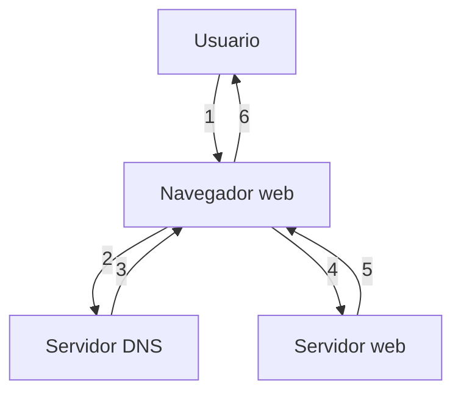

# 0.4 - Traditional web app flow

### Steps

1. The user types a URL into the browser.
2. The browser sends a DNS query to resolve the domain name.
3. The DNS server returns the IP address of the web server.
4. The browser sends an HTTP GET request to the web server.
5. The web server responds with HTML, CSS, and JavaScript files.
6. The browser processes the files and displays the webpage to the user.

