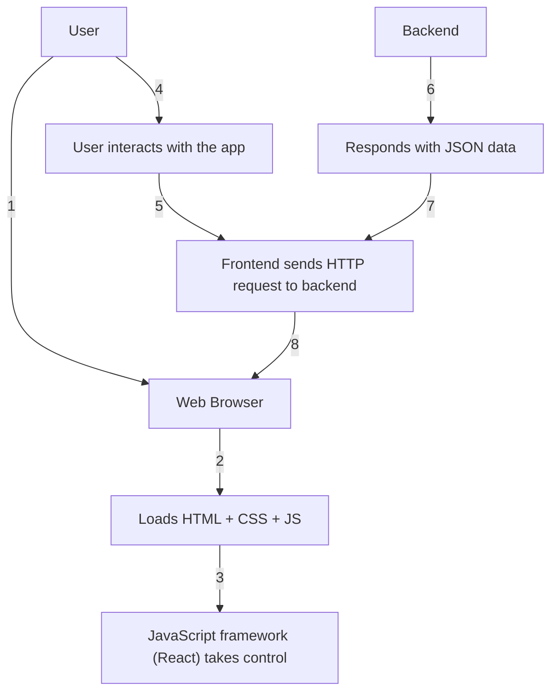

# 0.5 - Single Page Application (SPA) flow

## Steps

1. The user opens the application in the browser.  
2. The browser loads the HTML, CSS, and JavaScript files.  
3. The JavaScript framework (e.g., React) takes control of the page.  
4. The user interacts with the application (clicks, navigation).  
5. The frontend sends HTTP requests to the backend to fetch data when needed.  
6. The backend responds with data (usually JSON).  
7. The frontend receives the response and dynamically updates the visible content without reloading the page.

