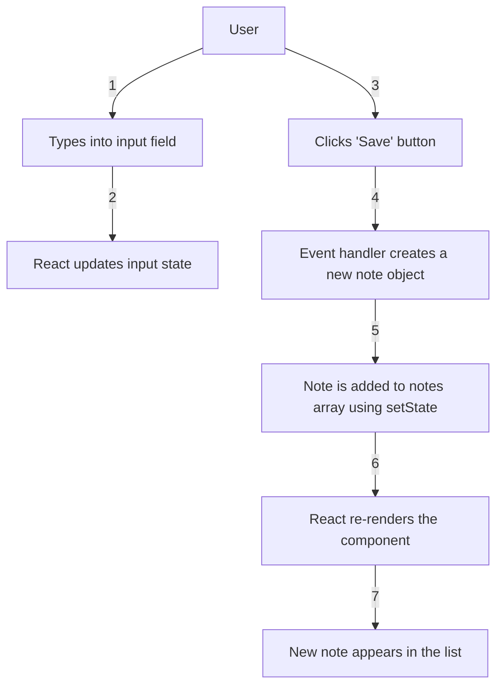

# 0.6 - Adding a new note (SPA example)

## Steps

1. The user types a note into the input field.  
2. React updates the component state on every keystroke.  
3. When the user clicks the "Save" button, the event handler runs.  
4. A new note object is created.  
5. The note is added to the notes array using setState.  
6. React re-renders the component.  
7. The new note appears in the list without reloading the page.
